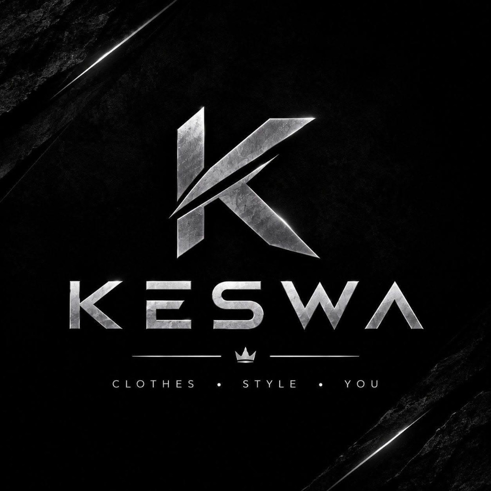

# ⚡ KESWA WEAR (Official E-Commerce Store & CMS)

<div align="center">
  
  <h3>CLOTHES • STYLE • YOU</h3>
  <p><strong>Premium Oversized Egyptian Streetwear E-Commerce Store with Real-time Dynamic CMS Admin Dashboard</strong></p>
</div>

---

## 🌟 Overview & Brand Identity

**KESWA WEAR** is an ultra-modern, high-end streetwear fashion e-commerce storefront tailored to perfection based on contemporary urban culture and heavy-gauge fleece apparel.

- **Metallic Chrome Brand Logo**: Scalable, high-resolution vector and chiseled metallic rendition of the iconic KESWA "K" blade monogram, royal crown emblem, and brand slogan: `CLOTHES • STYLE • YOU`.
- **Match to Lookbook Design**: 100% matched to the high-fashion streetwear lookbook layout, featuring full hero banners, category highlight masonry grids, product catalogs, flash discount countdown, and club newsletter.

---

## 🚀 Key Features

### 🛍️ 1. Complete E-Commerce Storefront
- **Sticky Glassmorphism Header**: Metallic logo, navigation tabs (`SHOP`, `HOODIES`, `T-SHIRTS`, `SWEATPANTS`, `SALE`), instant search, favorites/wishlist count, slide-out cart drawer, and quick CMS portal trigger.
- **Top Announcement Ticker**: Dynamic editable announcement bar with promo codes and link redirects.
- **Hero Hoodies Banner**: Oversized drop-shoulder streetwear showcase with direct call-to-action.
- **3-Card Category Masonry Grid**: Feature cards for Oversized Hoodies, Retro Polo Tees, and Baggy Sweats.
- **Product Sections**:
  - **Hoodies Grid**: 8 heavyweight hoodies (Washed Black, Burgundy, Maroon Zip, Tactical Utility, Oatmeal Heather, Acid Charcoal, Mocha Tan, Navy Blue).
  - **T-Shirts Grid**: 4 summer essentials (Retro Knit Polo, Urban Camo, Off-White Waffle, Olive Graphic).
  - **Sweatpants Grid**: 8 fleece joggers & cargos (Heather Grey, Navy Relaxed, Ecru Baggy, Vintage Charcoal, Dune Cargos, Jet Black, Slate Grey).
- **Interactive Product Cards**:
  - Hover image transitions.
  - Interactive color swatches.
  - Size pills (S, M, L, XL, XXL).
  - Sale & discount badges (`SALE -20%`, `BEST SELLER`, `NEW DROP`, `HOT`).
  - Quick "Add to Cart" and Wishlist heart button.
- **Quick View Modal**: Deep-dive popup with multi-angle image gallery, size and color selectors, quantity counters, and fabric assurances (100% Egyptian Cotton, 14-day returns).
- **Super Sale Flash Deal Banner**:
  - Moody dark streetwear backdrop.
  - **Live Countdown Timer**: Real-time ticker counting down Days, Hours, Minutes, and Seconds.
- **Newsletter Subscription**: Instant 10% coupon generation (`KESWA10`).
- **Full Streetwear Footer**: Brand centerpiece lockup, category links, customer care, Egypt contact information, social links, and accepted payment methods.

### 🛒 2. Cart & Egypt Checkout Flow
- **Slide-Out Cart Drawer**:
  - Live quantity adjustment (`+` / `-`).
  - Real-time Free Shipping progress bar (Free shipping on orders above 1500 EGP).
  - Promo coupon redemption (`KESWA10` applies 10% off).
- **Full Checkout Flow**:
  - Customer Full Name and Egyptian phone number validation.
  - All 27 Governorates of Egypt dropdown selection (Alexandria, Cairo, Giza, etc.).
  - Detailed address and delivery notes.
  - Cash on Delivery (COD) and Card payment options.
  - Confetti celebration upon order confirmation with unique Order Tracking ID (e.g. `#ORD-9481`).

---

## ⚙️ 3. Powerful CMS Admin Panel (لوحة التحكم الشاملة)

The Admin Dashboard provides full live control over every single element of the store with real-time updates and `localStorage` persistence:

1. **Frontend Texts & Buttons Editor (محرر نصوص وأزرار الواجهة)**:
   - Edit **ANY text or button** across the entire website:
     - Top announcement bar text, link, and visibility.
     - Brand name, tagline, and logo style (Metallic Vector / Original Badge).
     - Hero Banners 1, 2, 3, and 4: Title, Subtitle, Badge, Button Text, Button Target Link, and Image URL.
     - Product Section Titles, Subtitles, and "View All" button labels.
     - Super Sale title, button label, and target countdown date/time.
     - Footer description, phone, email, address, and copyright text.
2. **Products Manager (إدارة المنتجات)**:
   - Add new products with image URLs, sizes, colors, categories, prices, and badges.
   - Edit existing products in real-time.
   - Delete products.
3. **Banners & Promotions Manager (إدارة البنرات)**:
   - Toggle visibility of any section on/off.
   - Replace banner background imagery.
4. **Orders Manager (إدارة الطلبات)**:
   - View all customer orders with customer contact details, address, ordered items, and order totals.
   - Update order status with 1 click (`Pending`, `Processing`, `Shipped`, `Delivered`, `Cancelled`).
5. **Data Backup & Restore (النسخ الاحتياطي)**:
   - Export full store database as JSON.
   - Import JSON configuration file.
   - One-click factory reset button.

---

## 🛠️ Tech Stack

- **Framework**: React 19 + Vite 8
- **Styling**: Tailwind CSS 3.4
- **Icons**: Lucide React + Custom Metallic SVGs
- **Celebrations**: Canvas Confetti
- **Storage**: Persistent LocalStorage with Export/Import JSON
- **Fonts**: Inter, Syne, Montserrat, Oswald

---

## 💻 Local Development Setup

```bash
# 1. Clone repository
git clone https://github.com/Hazemabouseafa/KESWAWEAR.git

# 2. Enter directory
cd KESWAWEAR

# 3. Install dependencies
npm install

# 4. Start local development server
npm run dev
```

Visit `http://localhost:5173` in your browser.

### Production Build
```bash
npm run build
```
Creates an optimized static bundle in the `/dist` directory ready for deployment on GitHub Pages, Vercel, or Netlify.

---

## 👤 Author
Developed for **Hazem M. Abouseafa** ([@Hazemabouseafa](https://github.com/Hazemabouseafa))  
Brand: **KESWA WEAR — Clothes • Style • You**
